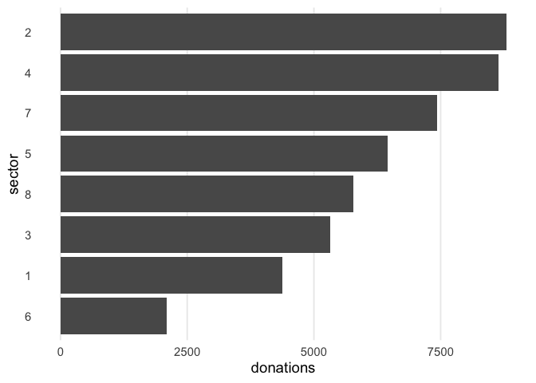

<!-- README.md is generated from README.Rmd. Please edit that file -->

# avalanchr

<!-- badges: start -->

[](https://www.tidyverse.org/lifecycle/#experimental)
[](https://CRAN.R-project.org/package=avalanchr)
<!-- badges: end -->

The goal of avalanchr is to streamline data workflows for the AVALANCHE
data science team. This package will help you connect to our databases,
easily construct summaries and visualizations, and create reports to
understand our data better.

## Installation

avalanchr is not yet on CRAN. In the meantime, you can install from our
GitHub page:

``` r
# install.packages("remotes")
remotes::install_github("malcolmbarrett/avalanchr")
```

## Example

This is a basic example which shows you how to solve a common problem:

``` r
library(avalanchr)
```

The main database connection function is `db_con()`. We also have
several wrappers to connect to the data.

``` r
db_con("residents_per_sector")
#>   sector residents
#> 1      1      1000
#> 2      2      2034
#> 3      3      4594
#> 4      4      2304
#> 5      5      8093
#> 6      6      1200
#> 7      7       300
#> 8      8      2398
get_resident_data()
#> # A tibble: 8 x 2
#>   sector residents
#>   <fct>      <dbl>
#> 1 1           1000
#> 2 2           2034
#> 3 3           4594
#> 4 4           2304
#> 5 5           8093
#> 6 6           1200
#> 7 7            300
#> 8 8           2398
```

Plot functions begin with `plot_()`

``` r
plot_donations()
```


